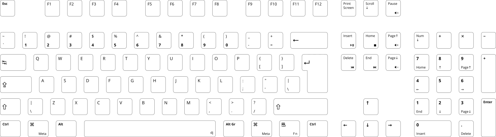
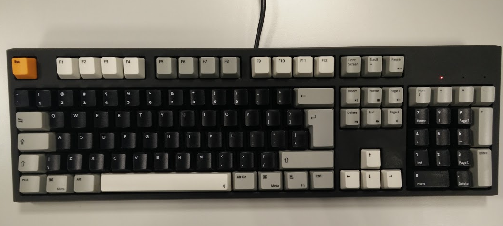

# opensans-wasd-keyboard
WASD keyboard layout based on the _OpenSans_ font

This keyboard layout can be used for creating a custom keyboard at [WASD Keyboards](http://www.wasdkeyboards.com/).

## Preview

## Resulting Keyboard Example
(Yes, it's mine...)

