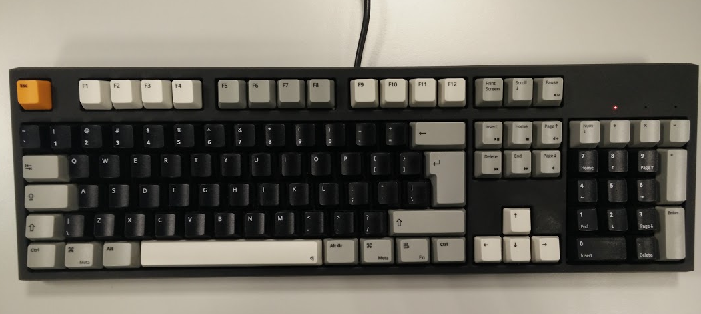

# opensans-wasd-iso-105
WASD keyboard layout based on the _OpenSans_ font

This keyboard layout can be used for creating a custom ISO-105 keyboard at [WASD Keyboards](http://www.wasdkeyboards.com/).

## Preview

## Result

